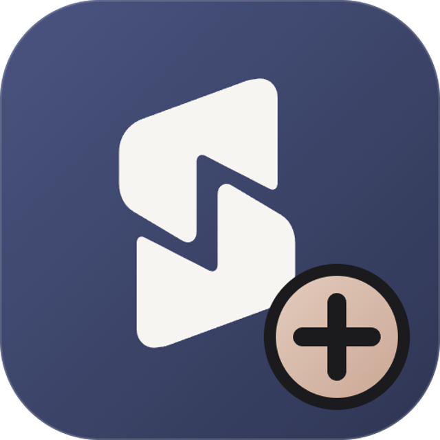

<div align="center">



# Sahne ProMax

**Stream alerts, live widgets, and local insights for Kick creators.**

KickBot · StreamElements · **Donofa** · Kick subscriptions

<p>
  <a href="https://github.com/B3hnamR/sahne-promax/releases/latest"></a>
  <a href="docs/README-FA.md"></a>
</p>

[](https://nodejs.org)
[](https://electronjs.org)
[](#architecture)
[](#testing)
[](LICENSE)
[](https://github.com/B3hnamR/sahne-promax/releases/latest)

<p align="center">
  <a href="#new-in-270">New in 2.7.0</a> ·
  <a href="#quick-start">Get started</a> ·
  <a href="#key-features">Features</a> ·
  <a href="#stream-deck-api">Stream Deck API</a> ·
  <a href="#architecture">Architecture</a>
</p>

</div>

---

## 📖 Overview

**Sahne ProMax** is a modernized, modular fork of [Sahne Plus](https://github.com/AmirEyZed/sahne-plus) designed for Kick streamers. It plays transparent WebM animations, GIFs, images, and audio alerts for **KickBot donations**, **StreamElements tips**, **Donofa donations**, **Kick subscriptions**, and **Kick gifted subscriptions**. The controller and alert server run locally, with no cloud backend and no runtime npm packages.

**2.7.0** incorporates the changes from upstream Sahne+ through [**1.4.1**](https://github.com/AmirEyZed/sahne-plus/releases/tag/v1.4.1), adapted to ProMax's modular backend and extra providers. ProMax also includes Donofa donations, a local analytics dashboard, OBS goal and top-donors widgets, Stream Deck controls, paired media, Kick chat commands, sub-first queue priority, milestone confetti, timed goals, counters, and alert history.

> **Note:** Sahne ProMax is an independent open-source project and is not affiliated with, endorsed by, or sponsored by Kick, KickBot, StreamElements, Donofa, Nobitex, or Baha24.

### Your first stream in three steps

| 01 · Install | 02 · Connect | 03 · Add to OBS |
| :--- | :--- | :--- |
| Get the [latest Windows installer](https://github.com/B3hnamR/sahne-promax/releases/latest). | Add a KickBot widget link, StreamElements token, or Donofa API key in the app. | Add `http://localhost:7788/overlay` as a Browser Source; optional widgets are at `/goal` and `/top`. |

<a id="new-in-270"></a>

### What's new in 2.7.0

| 🛟 Alerts survive interruptions | 🎬 Media plays to its end | 📊 History is your choice |
| :--- | :--- | :--- |
| Waiting alerts from KickBot, StreamElements, Donofa, and Kick survive restarts. Captured KickBot tips wait when the Browser Source disconnects; delayed Donofa TTS stays with its alert. | Long video and audio play to their actual end, and images can use a file-specific duration. A one-hour limit protects the queue from stuck media. | Turn off recording in **Settings → App**. New events stay out of saved history and analytics, while live totals and top donors update in memory until restart. Logs and waiting-alert storage are separate. |

KickBot queue delay and pause/play settings now apply; its disconnect cleanup leaves ProMax test alerts and other providers alone. Widget-link fields are masked and cleared after connection, the updater times out stalled downloads and reports disk errors, and the media editor rejects inverted amount ranges. Pull request CI is configured for Ubuntu and Windows.

### What's new in 2.6.0

- **Donofa:** Connect a Donofa API key from Settings to receive paid toman donations through Donofa's realtime feed. Donofa alerts use the existing queue, media tiers, routing rules, goal, history, and analytics. Donofa TTS audio can accompany an alert. The API key is encrypted with Electron `safeStorage` when available and omitted from backups; reconnect after restoring.
- **Analytics dashboard:** Choose a date range and explore trends, donor/source/currency breakdowns, amount distribution and playback status from local alert history. The existing ledger's 20,000-entry retention limit also limits detailed dashboard coverage. The dashboard does not send analytics data to any remote service.
- **Provider fixes:** Disconnecting KickBot retains queued alerts from other providers. The active alert chip shows the correct original currency alongside the toman equivalent.
- **Rates:** Removed the Bonbast fallback. Nobitex supplies the primary USD rate; Baha24 supplies fallback USD and supported non-USD rates. If Baha24 is unavailable, the app keeps the last known non-USD rates and logs that they are previous quotes.

## 💚 Donofa support

**Donofa donations are now a first-class alert source in ProMax.** Enter your Donofa API key under **Settings → Donofa**, choose `donofa.ir` or `donofa.com`, and connect. Paid donations arrive in **toman** through Donofa's realtime feed and use the same queue, media tiers, routing rules, goal widget, history, and analytics dashboard as other alerts. Optional Donofa TTS plays with the matching donation.

The card shows connection status without displaying the key. The key is stored locally, encrypted with Electron `safeStorage` when available, omitted from portable backups, and removed when you disconnect. Reconnect Donofa after restoring a backup. Live delivery still needs verification with a real Donofa account and donation.

---

See the [2.7.0 release notes](docs/releases/RELEASE_NOTES_2.7.0.md) for the full list.

---

## 🚀 ProMax additions compared with Sahne+ 1.4.1

I checked these against the [upstream 1.4.1 source](https://github.com/AmirEyZed/sahne-plus/tree/v1.4.1). They are present in ProMax and do not have an equivalent feature in that upstream release. This comparison is version-specific; it does not imply upstream will never add them.

| ProMax addition | What it does |
| --- | --- |
| **⌨️ Kick Chat Commands** | Viewers type `!command` in Kick chat and the mapped file plays, with per-viewer and global rate limits and a dedicated card template. |
| **🥇 Sub-First Queue Priority** | Sub and gift-sub alerts jump ahead of regular tips while keeping FIFO order inside each class; manual replays stay at the front. |
| **🎊 Milestone Confetti** | Overlay effects for goal completion, a large donation, and the first sub of the day. |
| **⏳ Timed Goal Countdown** | An optional deadline on the goal widget with a Persian countdown and expiry state. |
| **🔢 Sub & Gift Counters** | Goal-widget counters for subscriptions, gifted subscriptions, and today's subs. |
| **🥇 Top-Donors OBS Widget** | A separate `/top` Browser Source with a live leaderboard. Sahne+ has top donors in Analytics, but not this OBS widget. |
| **🎯 Live Goal OBS Widget** | A separate `/goal` Browser Source with progress, donation/sub updates, and completion effects. |
| **🎨 Multi-Profile Overlays** | Appearance profiles selected per OBS scene with `/overlay?profile=…`. |
| **🎵 Paired Media** | Attach an uploaded audio track to an image alert; playback follows the audio, subject to duration limits. |
| **🎖️ Subscription Tiers** | Per-file renewal-month and gift-count ranges for subscription alerts. |
| **🎛️ Stream Deck REST API** | Dedicated `/api/control/*` endpoints for skip, replay, pause, resume, mute, volume, and clear. |
| **💾 ZIP Backup & Restore** | Export and import settings, media, and saved history as a standard `.zip`. |
| **🧭 Media Routing Rules** | Ordered conditions for provider, event type, currency, amount, message, months, and gift count; a simulator explains the chosen file. |
| **💚 Donofa Tips** | Paid toman donations and optional TTS through Donofa, integrated with ProMax's queue, rules, widgets, and history. |

### Features now shared with upstream

| Capability | What differs in ProMax |
| --- | --- |
| **📜 Local alert history and analytics** | Sahne+ added its own local Analytics page and recording switch in 1.4.0. ProMax uses its `history.json` ledger with a 20,000-entry detail limit and keeps live totals in memory when recording is off. |
| **🪙 Currency conversion** | Both convert tips to toman. ProMax uses Nobitex for the primary USD rate and Baha24 for fallback and supported non-USD quotes. |
| **🎬 Queue recovery and long media** | Both now retain waiting alerts and let long media finish. ProMax adapts this behavior to Donofa, its sub-first queue, and its own overlay architecture. |

ProMax also uses a modular server and targeted SSE, ETag caching, and lazy file previews. Those are implementation choices, so they are documented under [Architecture](#architecture) and [Performance](#performance) rather than claimed as exclusive streamer features.

---

<a id="key-features"></a>

## ✨ Key Features

<a id="performance"></a>

### ⚡ Performance & Resource Efficiency

- **Non-Blocking Asynchronous I/O (`fs.promises`):** File uploads, media scans, and zip backup/restore use asynchronous file and stream operations to keep large media work off the main event loop.
- **Lazy On-Hover Video Decoding:** File cards in the controller render lightweight static posters; video preview elements decode only on mouse hover, dramatically reducing GPU decoder saturation and RAM spikes.
- **Targeted Server-Sent Events (SSE):** Controller and widgets receive live pushes (`state`, `config`, `goal_update`, `rate`, `backup_restored`); the top-donors widget also has a fallback refresh.
- **HTTP 304 ETag Static Caching:** Fonts, static CSS/JS, and branding assets leverage `ETag` headers to return `304 Not Modified`, saving socket bandwidth and speeding up OBS browser source refreshes.

### 🪙 Real-Time Currency Conversion

- **Nobitex USDT/IRT Orderbook (Primary):** Live dollar-to-toman conversion powered by Nobitex's real-time orderbook API (`/v3/orderbook/USDTIRT`), converting Iranian Rials to Toman with zero external dependencies.
- **Baha24 FX:** Baha24 supplies supported non-USD quotes during normal Nobitex operation and the fallback USD quote if Nobitex fails. If Baha24 has no usable FX quote, previously stored non-USD quotes remain in use and the failure is logged.
- **Proxy & Manual Pinning:** Configurable HTTP/HTTPS proxy support and manual rate locking — plus automatic use of the **Windows system proxy** (e.g. v2rayN in "system proxy" mode) for kick.com and rate sources when the manual field is empty.

### 🎬 Advanced Streamer Tools

- **⌨️ Kick Chat Commands:** Viewers type a command in Kick chat (`!dance`, `!hype`, …) and the mapped alert file plays on stream — free of charge. Three rate-limit layers (per viewer, global, per minute) plus a queue cap stop spam waves; each command maps to any uploaded file and has its own card template.
- **🥇 Queue Priority for Subs:** Subscriptions and gift-sub alerts jump ahead of regular tips in the queue (FIFO inside each class), so live moments play while they are fresh. Capture retries return to the back after their delay; manual replays go to the front.
- **🎊 Milestone Confetti:** Bursts of confetti on the overlay when the goal completes (once per goal), when a single donation passes a configurable threshold, or on the first sub of the day — all toggleable on the Goal page.
- **⏳ Timed Goal (Countdown):** Optional deadline for the goal widget with a live `DD روز HH:MM:SS` countdown, "زمان تمام شد" state, and server-clock correction against client clock skew.
- **🔢 Live Sub & Gift Counters:** The goal widget shows running totals — `⭐ ۱۲ ساب · 🎁 ۳۴ سابگیفت · امروز ۵ ساب` — updating on live sub and gift-sub events, persisting across restarts, and zeroing with the goal reset. Test and replay alerts do not increase them.
- **📜 Alert History & Daily Totals:** A dedicated page (and API) with recorded alerts, today's/7-day/all-time sums, per-day breakdown, and top donors. With recording enabled, the ledger keeps the newest 20,000 detailed entries; aggregate totals survive pruning until history is cleared, and saved history is included in backups. With recording disabled, new alerts contribute to live totals and top donors only until the app restarts.
- **🥇 Top-Donors OBS Widget:** `/top` Browser Source rendering a live leaderboard (`?range=daily|weekly|all&limit=1..20&title=…`) with medals for the top 3 and Persian Toman figures, refreshed by SSE on every alert.
- **🎵 Paired Media (Sound for Images):** Attach custom audio files (`.mp3`, `.wav`, `.ogg`) to static PNG/GIF/WebP images. The overlay follows the audio track's duration, subject to the file's configured cut and the one-hour safety limit.
- **🎨 Multi-Profile Scene Overlays:** Tailor appearance, positioning, and card scale for different OBS scenes via URL query parameters (e.g. `/overlay?profile=gameplay`, `/overlay?profile=chatting`) without running duplicate server instances.
- **🎯 Live Donation & Sub Goal Widget:** Dedicated OBS Browser Source (`/goal` & `/goal.html`) rendering real-time animated progress bars and Persian Toman figures, complete with celebratory confetti at 100%.
- **🎖️ Milestone & Tier Alerts:** Configure tier thresholds for subscription renewals (`minMonths` / `maxMonths`) and bulk gifted subscriptions (`minCount` / `maxCount`).
- **⏱️ Card Delay:** Show the name/amount card (and KickBot TTS) a few seconds after the alert media starts — globally on the Look page, or per file in the file editor.
- **💾 Backup & Restore:** Export and import settings, media and alert history as standard `.zip` archives. The limit is 512 MB per entry, 1 GB per archive, and 1,000 entries. Backups omit provider and proxy credentials, so reconnect KickBot, StreamElements and Donofa after restoring. Restore validates before replacing live files, keeps media absent from the archive and the current port, and leaves previously played alert IDs local to each installation.

### 🔄 Updates & Connectivity

- **In-App Updater:** The desktop app checks this fork's GitHub Releases 30 s after start and every 6 hours (can be turned off in Settings). Clicking **آپدیت** downloads the ProMax installer, checks it against the release's `SHA256SUMS.txt`, and starts installation after the download; it never downloads or installs an update on its own.
- **Kick Behind a Filter:** If kick.com is filtered on your network, Sahne ProMax automatically uses your VPN app's Windows system proxy (manual proxy still wins; SOCKS-only setups need TUN mode or a manual HTTP proxy).
- **Readable Kick Errors:** The Kick card explains problems in Persian — kick.com filtered, channel not found, request refused — instead of raw codes like `read ECONNRESET`.
- **StreamElements Tips:** Connect with the JWT token from StreamElements → Account → Channels → Show secrets. The credential is stored locally and uses Electron `safeStorage` encryption when available; disconnect it from Settings to remove it.
- **Donofa Tips:** Enter the Donofa API key in Settings and choose `donofa.ir` or `donofa.com`. Paid toman donations arrive through Donofa's realtime feed. The key is stored locally, encrypted when `safeStorage` is available; it is never included in a portable backup.
- **Other Tip Currencies:** Supported StreamElements currencies are converted using the available rate and matched against the same toman-based alert tiers. The alert card retains the original amount and currency; an unsupported currency stays labeled without an invented toman conversion. In card templates, `{original}` shows the source amount and `{usd}` is populated only for USD tips.

---

<a id="stream-deck-api"></a>

## 🎛️ Stream Deck & Hardware REST API

Sahne ProMax provides loopback endpoints for Elgato Stream Deck, Loupedeck, Touch Portal, or custom macro keypads:

| Endpoint              | Method | Parameters   | Description                                          |
| --------------------- | ------ | ------------ | ---------------------------------------------------- |
| `/api/control/skip`   | `POST` | None         | Immediately stops current alert and advances to next |
| `/api/control/replay` | `POST` | None         | Re-enqueues and replays the last finished alert      |
| `/api/control/pause`  | `POST` | None         | Pauses alert queue playback                          |
| `/api/control/resume` | `POST` | None         | Resumes alert queue playback                         |
| `/api/control/mute`   | `POST` | None         | Toggles master overlay audio mute                    |
| `/api/control/volume` | `POST` | `val=0..100` | Sets master overlay volume                           |
| `/api/control/clear`  | `POST` | None         | Clears all pending alerts in queue                   |

---

<a id="quick-start"></a>

## 🚀 Quick Start

### Prerequisites

- **Operating System:** Windows 10 or 11 (x64)
- **OBS Studio** or **Meld Studio** to display alerts and widgets on stream
- **Node.js `>= 22.0.0`** only if running or building from source; the Windows installer includes the app runtime

### Installation & Running

**Download the installer** from the [Releases page](https://github.com/B3hnamR/sahne-promax/releases/latest) — or run from source:

```bash
# Clone the repository
git clone https://github.com/B3hnamR/sahne-promax.git
cd sahne-promax

# Install the locked development dependencies (Electron & Prettier)
npm ci

# Run the automated test suite
npm test

# Launch the desktop application
npm start
```

### OBS Studio Setup

1. In OBS, add a **Browser Source**.
2. **Alert Overlay URL:** `http://localhost:7788/overlay` (Width: `1920`, Height: `1080`).
   - For specific scenes: `http://localhost:7788/overlay?profile=gameplay`
3. **Goal Widget URL:** `http://localhost:7788/goal` (Width: `640`, Height: `170` — use `200` when the timer is on).
4. **Top-Donors URL:** `http://localhost:7788/top?range=all&limit=5` (Width: `420`, Height: `240`).
5. Check **Shutdown source when not visible** and **Refresh browser when scene becomes active**.

---

<a id="architecture"></a>

## 🏗️ Architecture

Sahne ProMax follows a strict **zero-runtime-dependency** philosophy. All core server functionality relies exclusively on standard Node.js native modules (`http`, `https`, `crypto`, `fs`, `path`, `zlib`).

```
sahne-promax/
├── electron/                 # Electron main process, tray menu, DPAPI bridge, in-app updater
├── server/                   # Decoupled backend domain modules
│   ├── index.js              # Server orchestrator & lifecycle management
│   ├── constants.js          # System limits, MIME types, default configuration
│   ├── logger.js             # Redacted in-memory ring buffer & file logging
│   ├── sse.js                # SSE subscriber hub (overlay, admin, goal, preview)
│   ├── config/               # Atomic config persistence, played-tip & history ledgers
│   ├── features/             # Goal widget engine & 1-click zip backup/restore
│   ├── http/                 # Hardened loopback router, static server, range streaming
│   ├── integrations/         # KickBot/StreamElements/Donofa feeds, Kick chat, Meld monitor
│   ├── media/                # Async media manager & streaming upload sniffer
│   ├── playback/             # Priority queue scheduler & payment capture engine
│   ├── rates/                # Nobitex USD and Baha24 FX/fallback
│   └── utils/                # Magic byte sniffing, sanitizers, HTTP client, proxy routing
├── public/                   # Frontend assets
│   ├── app.html              # Main controller dashboard
│   ├── goal.html             # Standalone OBS goal widget
│   ├── overlay.html          # OBS alert overlay
│   ├── top.html              # Standalone OBS top-donors widget
│   └── js/                   # Native ES Modules (api, state, files, look, goal, etc.)
├── docs/                     # Documentation & guides
│   ├── ARCHITECTURE.md       # Technical architecture specification
│   ├── DATA_FLOW.md          # Network flows & privacy disclosures
│   ├── README-FA.md          # راهنمای جامع فارسی
│   ├── legal/                # Privacy, terms, and third-party notices
│   └── releases/             # Historical release notes
└── test/                     # Automated test suites
    ├── analytics.test.js     # Local dashboard aggregation
    ├── backend-audit.test.js # Restore, connection, rate and persistence regressions
    ├── donofa.test.js        # Donofa connection and alert handling
    ├── features.test.js      # Queue priority, chat commands, confetti, timed goal
    ├── frontend-audit.test.js # Controller and overlay behavior regressions
    ├── frontend-dropdown.test.js # Dropdown behavior
    ├── frontend-history.test.js # History UI behavior
    ├── overlay-long-media.test.js # Long media playback behavior
    ├── overlay-xss.test.js   # XSS & CSS injection prevention, card delay, confetti DOM
    ├── port.test.js          # Provider storage, backup and API port regressions
    ├── promax.test.js        # ProMax features & Nobitex rate tests
    ├── rules.test.js         # Media routing rules
    ├── server.test.js        # Hardening, loopback security, SSE caps, media gating
    ├── stats.test.js         # History ledger, top donors, live counters, backup round-trip
    ├── update.test.js        # Update version/redirect/checksum helpers
    ├── updater-audit.test.js # Download streaming and error handling
    ├── upstream-sync.test.js # Sahne+ 1.4.1 port regressions
    └── verify-checksums.ps1.test.js # Release checksum verifier
```

---

## 🛡️ Security & Privacy

- **No Cloud Backend:** Your media, settings, logs, and alert history remain on your machine (`Documents\Sahne Plus`); the app connects directly to the third-party services its features need.
- **Local Secrets:** KickBot, StreamElements and Donofa credentials use Windows DPAPI through Electron `safeStorage` when available. If encryption is unavailable, they are stored locally in plaintext; portable backups omit them. The local HTTP API does not return the credentials, and logs redact them.
- **Strict Loopback Protection:** The local server binds exclusively to `127.0.0.1` and enforces strict `Host` and `Origin` validation to block DNS rebinding and cross-site request forgery (CSRF).
- **Event-Stream Gating:** `/events` refuses cross-site pages (`Origin` / `Sec-Fetch-Site`) and caps concurrent streams per role, so a random open browser tab can't consume alerts while OBS is closed.
- **Registered-Media Only:** `/media/…` serves only files registered as alerts (or their paired audio) — never notes or partial uploads left in the folder.
- **No Remote Debugging:** The packaged app strips Chromium's `--remote-debugging-*` switches so the controller window can't be scripted over the DevTools protocol.
- **Hardened CSP:** Content Security Policies isolate overlay rendering, block remote script executions, and prevent XSS or CSS iframe escapes.
- **Checksum-Checked Updates:** The updater downloads solely from this fork's Releases and runs the installer only if its SHA-256 matches the release's `SHA256SUMS.txt` — and only after you click. The installer is not code-signed.

For detailed privacy information and network flow mapping, see [`docs/DATA_FLOW.md`](docs/DATA_FLOW.md) and [`docs/legal/PRIVACY.md`](docs/legal/PRIVACY.md).

---

<a id="testing"></a>

## 🧪 Testing

Run the automated test suite with Node's native test runner:

```bash
npm test
```

The integration and unit tests run in offline test-harness mode:

- ✅ Paired Media & Milestone Sub Alerts matching logic
- ✅ Stream Deck & Hardware REST Controls
- ✅ Donation & Sub Goal Engine (auto-increment, target reset, SSE)
- ✅ Zero-Dependency 1-Click Backup & Restore (.zip round-trip)
- ✅ ETag Static Caching (HTTP 304 Not Modified)
- ✅ Nobitex USDT/IRT Rate Provider & Baha24 Fallback
- ✅ Magic byte sniffing (blocks renamed executables)
- ✅ Persian & Arabic-Indic digit normalization
- ✅ Loopback hardening (Host / Origin / Traversal guards)
- ✅ Overlay XSS & CSS escape sanitization
- ✅ System-proxy parsing, route order & readable Kick errors
- ✅ Card delay (per-file over appearance; TTS waits for the card)
- ✅ Update version parsing, release-redirect pinning & checksum lookup
- ✅ StreamElements tip normalization and non-USD currency conversion
- ✅ Event-stream origin refusal & per-role connection caps
- ✅ Media route serves registered alerts only
- ✅ Queue priority (subs/gift-subs first, FIFO inside a class, replay/retry safe, flood cap keeps subs)
- ✅ Chat commands (file mapping, cooldowns, flood cap, orphan-file rejection)
- ✅ Milestone confetti (goal complete once, big-donation threshold, first sub of the day)
- ✅ Timed goal countdown (fields, expiry, clearing)
- ✅ Live counters (subs / gift-subs / subs today; test traffic and reset behaviour)
- ✅ History ledger (day & donor aggregates, 20k pruning, persistence, clear)
- ✅ History API + live `history_update` SSE, top-donors ranges & ordering
- ✅ Backup round-trip carries `history.json`
- ✅ Bounded streaming backups, validation before restore, credential omission, local-media preservation, and provider reconnection guidance
- ✅ Stale connection and save sequencing, failed-delete media edits, rate timing, and browser version display
- ✅ Installer download stream errors and release checksum verification

---

## 📜 License

Open source under the [Apache License 2.0](LICENSE).  
Copyright © 2026 Behnam & Contributors. Based on upstream work by [AmirEyZed](https://github.com/AmirEyZed/sahne-plus).
